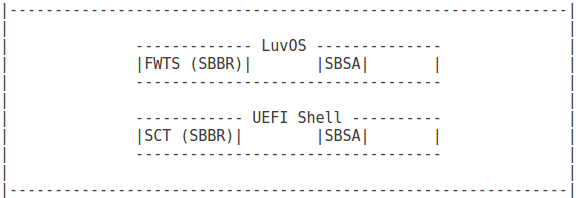

# ARM Enterprise ACS - Architecture Compliance Suite

## Architecture Compliance Suite
Architecture Compliance Suite (ACS) is used to ensure architectural compliance across different implementations of the architecture. ARM Enterprise ACS includes a set of examples of the invariant behaviours that are provided by the [SBSA](http://infocenter.arm.com/help/index.jsp?topic=/com.arm.doc.den0029/index.html) and [SBBR](http://infocenter.arm.com/help/topic/com.arm.doc.den0044b/DEN0044B_Server_Base_Boot_Requirements.pdf) specifications, so that implementers can verify if these behaviours have been interpreted correctly. ACS is delivered with tests in source form along with a build script, the output of the build being a bootable Linux UEFI Validation (LUV) OS image that can run all Server Base System Architecture (SBSA) and Server Base Boot Requirements (SBBR) tests.
 
 

</img>

#### Figure 1 Components of ARM Enterprise ACS

ARM Enterprise ACS tests are available open source. The tests and the corresponding abstraction layers are available with an Apache v2 license allowing for external contribution.

In summary, the ARM Enterprise ACS product contains the following: <ol>
1. Scripts to build, construct, and run the test images.  
2. A bootable LUV OS image capable of running all SBSA and SBBR tests.  
3. Documentation on running the tests.   </ol>

These tests are split between a UEFI application and a Linux driver that together determine whether an architectural implementation is compliant with the SBSA
and SBBR specifications. These tests are further described in detail.

## Release details
 - Code Quality: REL v1.0
 - The SBSA tests are written for version 3.0 of the SBSA specification.
 - The SBBR tests are written for version 1.0 of the SBBR specification.
 - The compliance suite is not a substitute for design verification.
 - To review the ACS logs, ARM licensees can contact ARM directly through their partner managers.
  
## GitHub branch
- To pick up the release version of the code, checkout the release branch with the appropriate tag.
- To get the latest version of the code with bug fixes and new features, use the master branch.

## Server Base System Architecture - Architecture Compliance Suite
SBSA specification outlines various system architecture features and software stack functionality that operating systems, hypervisors, and firmware can rely on.
SBSA test suites check for compliance against the SBSA specification. For more information, see [SBSA github](https://github.com/ARM-software/sbsa-acs). The tests are delivered through two runtime executable environments:
 - UEFI Shell SBSA tests
 - OS SBSA tests

### UEFI Shell SBSA tests
These tests are written on top of Validation Abstraction Layer (VAL) and Platform Abstraction Layer (PAL).

The abstraction layers provide platform information and runtime environment to enable execution of the tests.
In the present release, PAL is written on top of UEFI and ARM Trusted Firmware. For the OS tests, it is written on top of Linux kernel.
Partners can also write their own abstraction layer implementations to allow SBSA tests to be run in other environments, for example, as raw workload on an RTL simulation.

### OS SBSA tests
Execution of some SBSA tests requires an OS environment.
This is particularly true for IO tests.
Currently, LUV OS is used. However, other OS images could be considered in future.

## Server Base Boot Requirements - Architecture Compliance Suite
SBBR specification compliments the SBSA specification by defining the base firmware requirements
required for out-of-box support of any SBSA compatible operating system or hypervisor. These requirements are comprehensive enough
to enable booting multi-core 64-bit ARMv8 server platforms while remaining minimal enough to allow for OEM and ODM innovation, and
market differentiation.

For more information, see SBBR specification.

This release includes both UEFI Shell and OS context tests that are packaged into a bootable LUV OS image.
The SBBR test suites check for compliance against the SBBR specification. Like the SBSA tests, these tests are also delivered through two runtime executable environments:
  - UEFI Self Certification Tests
  - SBBR based on Firmware Test Suite
 
### UEFI Self Certification Tests 
Self Certification Tests (SCTs) test the UEFI implementation requirements defined by SBBR. The SCT implementation can eventually merge into the EDK2 tree and as a result, SBBR tests in these deliverables leverage those present in EDK2.

### SBBR based on Firmware Test Suite
Firmware Test Suite (FWTS) is a package that is hosted by Canonical. FWTS provides tests for ACPI, SMBIOS and UEFI.
Several SBBR assertions are tested though FWTS.

## ACS build steps

### Prebuilt images
 - Prebuilt images for each release are available in the prebuilt_images folder of the release branch. You can choose to use these images or build your own image by following the steps below.
- Note:The prebuilt image does not include tests based on UEFI-SCT framework.
- If you choose to use the prebuilt image, skip the build steps and jump to the test suite execution section below.

### Prerequisites
Before starting the ACS build, ensure that the following requirements are met:
 - Ubuntu 16.04 LTS with at least 64GB of free disk space.
 - Must use Bash shell.
 - UEFI SCT based tests are not built by default. To build UEFI SCT, membership of [https://github.com/UEFI/UEFI-SCT](https://github.com/UEFI/UEFI-SCT) is necessary. If you are not a member, you must request access by sending an e-mail to admin@uefi.org by providing your GitHub account ID. 

Note : Windows build steps will be provided in the future releases.
 

Perform the following steps to start the ACS build:

1. Create a directory that is your workspace and `cd' into it.  
   $ mkdir &lt;work_dir&gt; && cd &lt;work_dir&gt;  
2. Clone the ARM Enterprise ACS source code.  
   $ git clone https://github.com/ARM-software/arm-enterprise-acs.git  
   $ cd arm-enterprise-acs  
   $ git checkout master  
3. Download and patch LUV OS source code.  
   $ ./acs_sync.sh  
   $ cd luv  
4. Build LUV OS and test binaries.  
   $ ./build_luvos.sh

Note: 
- These build steps only target AArch64.  
- By default, the build script excludes UEFI SCT in the built images. 
  If SCT must be included, enter "no" when prompted "To continue without building UEFI-SCT.  Enter [yes(default)/no]: ", and then enter GitHub details for the UEFI-SCT member account. 
- The build script provides the option to append kernel command-line parameters, if necessary. Press enter to continue with default parameters.  

## Build output
The luv-live-image-gpt.img bootable image can be found in:
&lt;work_dir&gt;/arm-enterprise-acs/luv/build/tmp/deploy/images/qemuarm64/luv-live-image-gpt.img 

This image comprises of two FAT file system partitions recognized by UEFI:  
- 'luv-results'  
  Stores logs and is used to install UEFI-SCT. (Approximate size: 120 MB)  
- 'boot'  
  Contains bootable applications and test suites. (Approximate size: 60 MB)

For more information, see [Yocto Project](https://www.yoctoproject.org/documentation) and [LuvOS](https://github.com/01org/luv-yocto).  

## Juno Reference Platform

Follow the instructions [here](https://community.arm.com/docs/DOC-10804) to install an EDK2 (UEFI) prebuilt configuration on your Juno board.
For additional information, see the FAQs and tutorials [here](https://community.arm.com/groups/arm-development-platforms) or contact [juno-support@arm.com](mailto:juno-support@arm.com).

After installing the EDK2 prebuilt configuration on your Juno board, follow these steps:

1. Burn the LUV OS bootable image to a USB stick:  
$ lsblk  
$ sudo dd if=&lt;sbsa&gt;/luv-live-image-gpt.img of=/dev/sdX  
$ sync  
Note: Replace '/dev/sdX' with the handle corresponding to your
  USB stick as identified by the `lsblk' command.
2. Insert the USB stick into one of the Juno's rear USB ports.
3. Power cycle the Juno.

## Fixed Virtual Platform (FVP) environment

The steps for running the ARM Enterprise ACS on an FVP are the
same as those for running on Juno but with a few exceptions:

- Follow the different instructions [here](https://community.arm.com/dev-platforms/b/documents/posts/using-linaros-deliverables-on-an-fvp) to install an EDK2 (UEFI) prebuilt configuration on your FVP.
- Modify 'run_model.sh' to add a model command argument that
  loads 'luv-live-image-gpt.img' as a virtual disk image. For example,
  if running on the AEMv8-A Base Platform FVP, add 
`bp.virtioblockdevice.image path=<work_dir>/arm-enterprise- acs/luv/build/tmp/deploy/images/qemuarm64/luv-live-image-gpt.img' 
to your model options.  
Or,  
To launch the FVP model with script ‘run_model.sh’ that supports -v option for virtual disk image, use the following command:
$ ./run_model.sh -v <work_dir>/arm-enterprise-acs/luv/build/tmp/deploy/images/qemuarm64/luv-live-image-gpt.img

## Test suite execution
The test suite execution can be automated or manual. Automated execution is the default execution method.  
Note: SBBR SCT tests are not included as part of automation. For information about running these tests, see section ‘SBBR SCT tests’ in this document.  
The execution varies depending on the test environment.
The next set of commands are an example of our typical run of the test suites.
Note that the File System Partition in your platform can vary.  

The live image boots to UEFI Shell. The different test applications can be run in following order:
1. SBSA UEFI Shell application
2. SBBR SCT tests
3. LUV OS FWTS tests
4. SBSA OS tests

### 1. SBSA UEFI Shell appplication
 Enter the following commands to run the SBSA test on UEFI:

- Shell>FS2:
- FS2:>FS3:\EFI\BOOT\sbsa\sbsa.nsh

If any failures are encountered, see [SBSA User Guide](https://github.com/ARM-software/sbsa-acs/raw/master/docs/SBSA_ACS_User_Guide.pdf) for debug options.
Power reset the system after completion of this test and continue with the next step.  

Note:
- Here FS2: is assumed to be the 'luv-results' partition, and FS3: the 'boot' partition.
- These commands are applicable only for the first time when the image is executed to install the SCT tests.

### 2. SBBR SCT tests
SBBR SCT tests are available only if the test suite is built with UEFI-SCT. By Default, UEFI-SCT is not included in the test suite.  

Enter the following commands to install SCT.

- Shell>FS3:
- FS3:>cd EFI\BOOT\sbbr
- FS3:\EFI\BOOT\sbbr>InstallAARCH64.efi

Choose the partition to install SCT on. In a typical run it is FS2:, the 'luv-results' partition.

Enter the following commands after installation of SCT:

- Shell>FS2:
- FS2:>cd SCT  
 #To run all tests
- FS2:\SCT>SCT.efi -a -v

User can select and run tests based on available choices. For information about running the tests, see [SCT User Guide](http://http://www.uefi.org/testtools).

### 3. LUV OS FWTS tests

You can choose to boot LUV OS by entering the command:

- Shell>exit

This command loads the grub menu. Press enter to choose the option 'luv' that boots LUV OS and runs FWTS tests and OS context SBSA tests automatically.  

Logs are stored into the "luv-results" partition, which can be viewed on any machine after tests are run.
   For more information, see [YOCTO documentation](https://www.yoctoproject.org/documentation), or [YOCTO source code](https://github.com/01org/luv-yocto)  

### 4. SBSA OS tests
On Linux shell, enter the following commands:
#insmod /lib/modules/4.10.0-yocto-standard/extra/sbsa_acs.ko  
#sbsa  

## Debug Information
SBSA and SBBR source directories can be found at the following paths:
- SBBR FWTS source at /path/to/arm-enterprise-acs/luv/build/tmp/work/qemuarm64-oe-linux/fwts/V17.03.00+gitAUTOINC+e3e9d1442b-r0/git/ 
- SBBR SCT source at /path/to/arm-enterprise-acs/luv/build/tmp/work/aarch64-oe-linux/sbbr/v1.0+gitAUTOINC+d38be6dae3-r0/git/ 
- SBSA UEFI application source at /path/to/arm-enterprise-acs/tmp/work/aarch64-oe-linux/sbsa/1.0+gitAUTOINC+855051d821-r0/git/
- SBSA Linux user application source at /path/to/arm-enterprise-acs/luv/meta-luv/recipes-utils/sbsa-acs-app/sbsa-acs-app/
- SBSA Linux kernel module source at /path/to/arm-enterprise-acs/luv/meta-luv/recipes-core/sbsa-acs-drv/files/

To compile and test changes in the above source code, follow these steps:
- cd /path/to/arm-enterprise-acs/luv
- source oe-init-build-env

For SBSA UEFI application,
- bitbake sbsa -f -c compile
- bitbake sbsa

For SBSA linux user application,
- bitbake sbsa-acs-app -f -c compile
- bitbake sbsa-acs-app

For SBSA linux kernel module,
- bitbake sbsa-acs-drv -f -c compile
- bitbake sbsa-acs-drv

For SBBR FWTS,
- bitbake fwts -f -c compile
- bitbake fwts

For SBBR SCT,
- export SCTOPTIONAL=”no”
- export BB_ENV_EXTRAWHITE="BB_ENV_EXTRAWHITE SCTOPTIONAL"
- bitbake sbbr -f -c compile
- bitbake sbbr

After this, run the following command to create an updated luv live image: 
- bitbake luv-live-image

## Baselines for Open Source Software in this release:

- [Linux UEFI Validation OS](https://github.com/01org/luv-yocto)
        - SHA: 6a81889e91dd8373b9840350f69332416be0ab0b

- [Firmware Test Suite (FWTS) TAG: V17.03.00](http://kernel.ubuntu.com/git/hwe/fwts.git)

- [Server Base System Architecture (SBSA)](https://github.com/ARM-software/sbsa-acs) TAG: d79cf4415f4a50e7825c27db1a666cfbb4cc01d3

- [UEFI Self Certification Tests (UEFI-SCT)](https://github.com/UEFI/UEFI-SCT) TAG: c78ea66cb114390e8dd8de922bdf4ff3e9770f8c

Note:   You must be a member of [UEFI-SCT](https://github.com/UEFI/UEFI-SCT). If you are not a member, you must request access by sending an e-mail to [admin@uefi.org](mailto:admin@uefi.org) by specifying your GitHub ID.

## Validation

a. Tests run on Juno Reference Platforms

         i. SBSA Tests. (UEFI Shell based tests)
        ii. SBSA Tests. (OS based tests built on top of Linux kernel)
       iii. SBBR Tests. (Optional UEFI Shell based tests built on top of UEFI-SCT Framework, excluded by default)
        iv. SBBR Tests. (OS based tests built on top of FWTS Framework)

b. Known issues
SBBR (UEFI-SCT) Timer tests might hang. They can be recovered by resetting the system.

c. Planned enhancements
       Upstream SBBR code to open source repositories FWTS and UEFI-SCT.

## License

ARM Enterprise ACS is distributed under Apache v2.0 License.

## Feedback, contributions, and support

 - For feedback, use the GitHub Issue Tracker that is associated with this repository.
 - For support, please send an email to "support-enterprise-acs@arm.com" with details.
 - ARM licensees can contact ARM directly through their partner managers.
 - ARM welcomes code contributions through GitHub pull requests. For details, see "docs/Contributions.txt".
